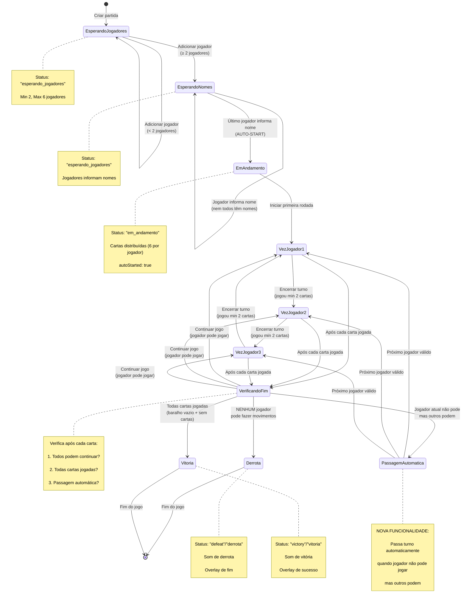
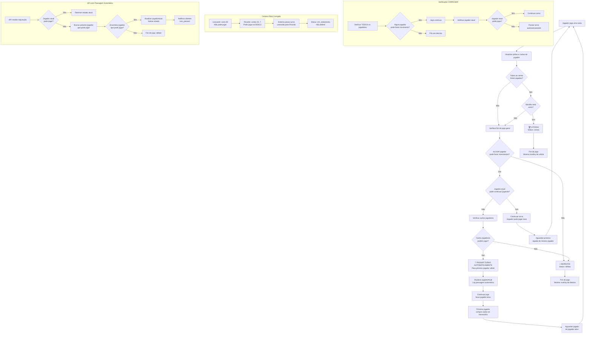

# Arquitetura da Solução — The Game Online

## Visão Geral

A aplicação é uma versão digital do jogo de tabuleiro "The Game", construída com **Next.js 15+ (App Router)**, **TypeScript**, **Tailwind CSS**, **TDD**, e arquitetura limpa. O sistema suporta múltiplos jogadores, administração de partidas, lógica de jogo no frontend/backend, persistência em arquivo JSON e atualização em tempo real via WebSocket.

---

## 1. Stack e Tecnologias
- **Next.js 15+**: Framework React para SSR/SSG, App Router, API Routes.
- **TypeScript**: Tipagem forte em todo o projeto.
- **Tailwind CSS**: Estilização utilitária e responsiva.
- **Jest + React Testing Library**: Testes unitários e de componentes (TDD).
- **socket.io**: WebSocket para atualização em tempo real.
- **Arquitetura Limpa**: Separação de domínio, infraestrutura, apresentação e dados.

---

## 2. Estrutura de Pastas
```
the-game/
  docs/          # Documentação do projeto
  src/
    app/           # Páginas e rotas Next.js (App Router)
      api/         # API REST para manipulação da partida
      partida/     # Páginas dinâmicas de cada partida
    components/    # Componentes funcionais e reutilizáveis
    data/          # Persistência (partida.json)
    domain/        # Lógica de negócio (funções puras, testes)
```

---

## 3. Diagrama de Estados do Jogo



---

## 4. Fluxograma da Lógica de Finalização



---

## 5. Fluxo de Dados

### a) Criação de Partida
- Usuário clica em "Criar partida" na home.
- Frontend gera UUID, inicializa estado e faz POST na API (`/api/partida`).
- Link da sala é exibido para compartilhar.

### b) Entrada de Jogadores
- Jogadores acessam o link da sala.
- Nome/apelido é enviado via PUT para a API, que atualiza o arquivo JSON.
- Todos os clientes conectados recebem atualização via WebSocket.

### c) Início do Jogo (Auto-Start)
- **Trigger**: Último jogador informa nome
- **Ação**: Sistema detecta automaticamente e inicia o jogo
- **Processo**: Baralho é embaralhado, cartas distribuídas, ordem definida e status atualizado
- **Flag**: `autoStarted: true` marcada no estado da partida
- **Notificação**: Estado é persistido e broadcast via WebSocket

### d) Progresso do Jogo com Passagem Automática
- Cada jogador faz jogadas na sua vez, validando regras de "The Game" (funções puras em `domain/`).
- **NOVA FUNCIONALIDADE**: Se jogador atual não pode jogar mas outros podem, turno passa automaticamente
- **Verificação**: A cada requisição à API, sistema verifica se jogador atual pode continuar
- **Passagem**: Se não pode, busca próximo jogador válido e atualiza `jogadorAtual`
- **Log**: Registra passagem automática: `"Auto-passing turn from {id1} to {id2}"`
- Após o turno, cartas são compradas e o próximo jogador é definido.
- Fim de jogo (vitória/derrota) é detectado automaticamente.

### e) Atualização em Tempo Real
- Todas as telas conectam-se ao WebSocket (`/api/socket`).
- Qualquer alteração relevante (entrada, início, jogada, passagem de turno) emite evento.
- **Eventos**: `game:started`, `partida:updated`, `partida:turn_passed`
- Todos os navegadores recebem e atualizam o estado instantaneamente.

---

## 6. Domínio e Lógica de Negócio **CORRIGIDA**

### Arquivos Principais:
- **`checkGameEnd.ts`**: Lógica CORRIGIDA de verificação de fim de jogo
- **`nextPlayer.ts`**: Nova função `nextPlayerWhoCanPlay()`
- **`isValidMove.ts`**: Validação de movimentos individuais
- **`isMovePossible.ts`**: Verificação se jogador pode continuar
- **`dealCards.ts`**: Distribuição inicial de cartas
- **`shuffleDeck.ts`**: Embaralhamento do baralho

### Correções Implementadas:

#### 1. **Lógica de Fim de Jogo**
- **Antes**: Terminava em derrota se jogador atual não podia jogar
- **Depois**: Só termina em derrota se **NENHUM** jogador pode jogar
- **Implementação**: Verificação global antes de verificação individual

#### 2. **Passagem Automática de Turno**
- **Nova função**: `nextPlayerWhoCanPlay()` 
- **Funcionalidade**: Encontra próximo jogador que pode fazer movimentos
- **Prevenção**: Evita loops infinitos com `maxIterations`

#### 3. **Condições de Fim**
- **Vitória**: `baralho.length == 0 && todos_jogadores.cartas.length == 0`
- **Derrota**: `!jogadores.some(j => pode_jogar(j))`
- **Continuação**: Passagem automática quando jogador atual não pode jogar

### Testes e Cobertura:
- **checkGameEnd**: 7 testes cobrindo todos os cenários
- **nextPlayer**: 10 testes incluindo novos casos
- **Cobertura**: 34 testes passando, 6 suítes de teste
- TDD: testes escritos antes da implementação.
- Cobertura alta (>80%) em lógica de domínio e componentes principais.
- Testes de comportamento, não de implementação.

---

## 7. API REST com Passagem Automática

### Endpoints:
- **GET** `/api/partida`: Retorna o estado atual da partida + verifica passagem automática
- **POST** `/api/partida`: Cria nova partida (sobrescreve JSON).
- **PUT** `/api/partida`: Atualiza estado da partida + verifica auto-start + passagem automática

### Nova Funcionalidade:
- **Função**: `checkAndHandleAutomaticTurnPassing()`
- **Trigger**: A cada GET/PUT na API
- **Verificação**: Se jogador atual não pode jogar mas outros podem
- **Ação**: Atualiza `jogadorAtual` automaticamente para próximo jogador válido
- **Persistência**: Salva estado atualizado no arquivo JSON
- **Notificação**: Emite evento `partida:turn_passed` via WebSocket

### Persistência Temporária em Serverless (Vercel)

Em ambientes serverless como a Vercel, não é possível gravar arquivos na estrutura do projeto. Por isso, a API detecta se está rodando na Vercel (`process.env.VERCEL`) e, nesse caso, utiliza o diretório temporário `/tmp` para persistir o arquivo de partida:

```ts
const isVercel = !!process.env.VERCEL;
const PARTIDA_PATH = isVercel
  ? '/tmp/partida.json'
  : path.resolve(process.cwd(), 'src/data/partida.json');
```

- **Leitura:** Ao receber um GET, a API tenta ler `/tmp/partida.json`. Se não existir, inicializa vazio.
- **Escrita:** POST/PUT sobrescrevem o arquivo em `/tmp/partida.json` com o novo estado.
- **Importante:** O conteúdo de `/tmp` é volátil e só existe enquanto a instância está ativa. Ao reiniciar (timeout/deploy), o arquivo é perdido.
- **Local:** Fora da Vercel, a persistência continua em `src/data/partida.json` normalmente.

---

## 8. WebSocket (socket.io)
- Servidor WebSocket em `/pages/api/socket.ts`.
- Clientes conectam-se via `socket.io-client`.
- **Eventos**: 
  - `partida:update` - Atualizações gerais do estado
  - `game:started` - Quando jogo inicia automaticamente
  - `partida:turn_passed` - Quando turno passa automaticamente
- Todos os navegadores recebem atualizações em tempo real.

---

## 9. Componentização e UI
- Componentes pequenos, reutilizáveis e com responsabilidade única (SRP).
- Props tipadas, estilização com Tailwind, animações com Framer Motion.
- **Componentes principais**:
  - `GameBoard`: Tabuleiro principal do jogo
  - `GameEndOverlay`: Overlay reutilizável para fim de jogo
  - `PlayerList`: Lista de jogadores
  - `StatsPanel`: Estatísticas da partida
  - `ActionButton`: Botões de ação padronizados
- **Telas principais**: Home (criação), Sala (entrada/lista), Jogo (tabuleiro), Status (fim).

---

## 10. Regras do Jogo

### Objetivo:
Jogar cooperativamente para colocar todas as 98 cartas (2-99) nas 4 pilhas centrais.

### Pilhas:
- **2 Ascendentes**: Começam em 1, crescem até 99
- **2 Descendentes**: Começam em 100, decrescem até 2

### Saltos Especiais:
- **Salto para trás**: Diferença exata de 10
- **Exemplo ASC**: Se topo é 50, pode jogar 40
- **Exemplo DESC**: Se topo é 30, pode jogar 40

### Turnos:
- **Mínimo**: 2 cartas por turno (1 se baralho vazio)
- **Reposição**: Até 6 cartas na mão
- **Ordem**: Fixa, rotativa entre jogadores
- **⚠️ NOVO**: Passagem automática se jogador não pode jogar

---

## 11. Boas Práticas
- SOLID, funções puras, early return, tipagem forte, sem duplicação.
- Código limpo, legível e fácil de manter.
- Separação clara entre domínio, infraestrutura e apresentação.
- **Inglês**: Nomes de variáveis, funções, métodos, tipos e comentários sempre em inglês.
- **Português**: Apenas conteúdo exibido ao usuário.

---

## 12. Extensões Futuras
- Suporte a múltiplas partidas simultâneas.
- Autenticação e ranking.
- WebSocket real-time (substituir polling).
- Persistência real (banco de dados).
- WebSocket global para múltiplas salas.
- Interface para diferentes idiomas.

---

## 13. Documentação Adicional

- **`docs/GAME_FLOW_DOCUMENTATION.md`**: Documentação detalhada do fluxo do jogo
- **Diagramas**: Estados, fluxograma de finalização, cálculo de rodadas
- **Testes**: Cobertura completa da lógica de domínio
- **API**: Documentação dos endpoints e funcionalidades

---

**Dúvidas ou sugestões? Fale com o desenvolvedor!** 